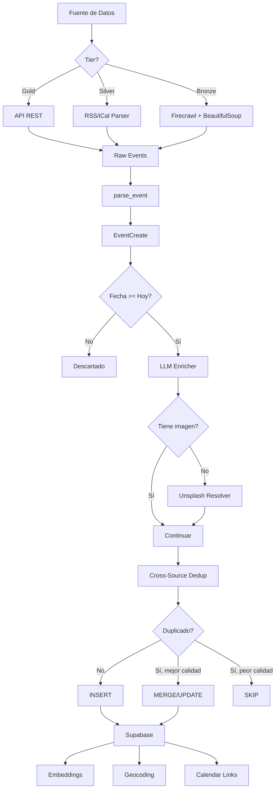
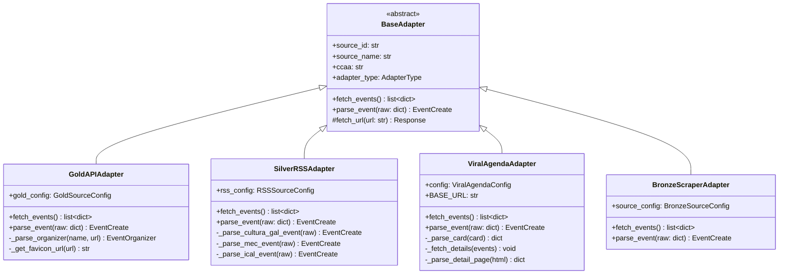
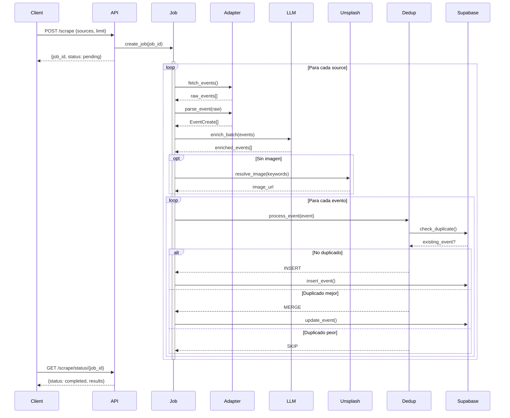
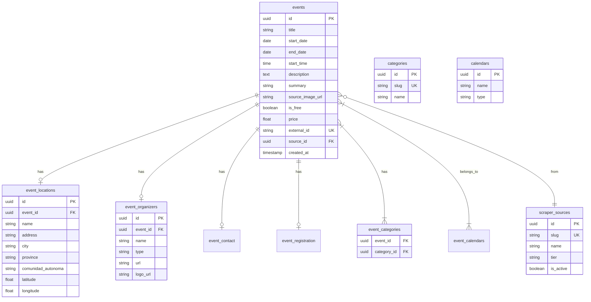
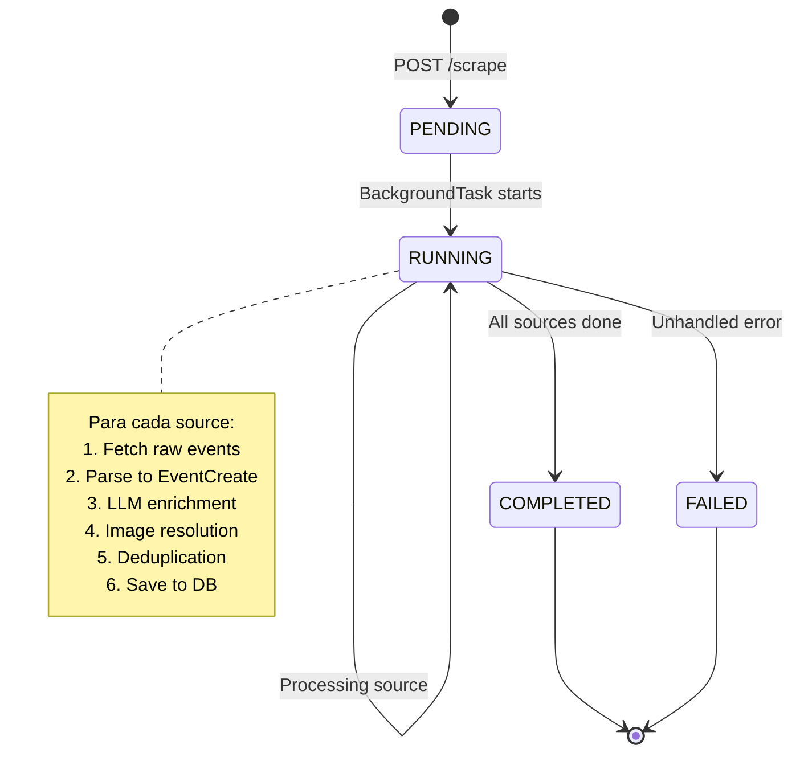

# AGENDADES Web Scraper

Sistema de scraping multi-fuente para eventos culturales de España. Recopila, enriquece y almacena eventos de todas las Comunidades Autónomas en una base de datos Supabase.

## Tabla de Contenidos

- [Arquitectura](#arquitectura)
- [Estructura del Proyecto](#estructura-del-proyecto)
- [Instalación](#instalación)
- [Configuración](#configuración)
- [Fuentes de Datos](#fuentes-de-datos)
- [API REST](#api-rest)
- [CLI](#cli)
- [Pipeline de Procesamiento](#pipeline-de-procesamiento)
- [Modelos de Datos](#modelos-de-datos)
- [Diagramas UML](#diagramas-uml)
- [Calidad de Datos](#calidad-de-datos)
- [Desarrollo](#desarrollo)

---

## Arquitectura

El sistema utiliza una arquitectura de 3 capas (Gold/Silver/Bronze) basada en la calidad y estructura de las fuentes de datos:

```
┌─────────────────────────────────────────────────────────────────────┐
│                         AGENDADES SCRAPER                            │
├─────────────────────────────────────────────────────────────────────┤
│                                                                      │
│  ┌──────────────┐  ┌──────────────┐  ┌──────────────┐               │
│  │   GOLD (7)   │  │  SILVER (2)  │  │  BRONZE (50+)│               │
│  │  APIs REST   │  │  RSS/iCal    │  │  Web Scraping│               │
│  │              │  │              │  │              │               │
│  │ - Catalunya  │  │ - Galicia    │  │ - Viralagenda│               │
│  │ - Euskadi    │  │ - Huesca     │  │   (33 ciudades)              │
│  │ - CyL       │  │              │  │ - CLM        │               │
│  │ - Andalucía  │  │              │  │ - Canarias   │               │
│  │ - Madrid     │  │              │  │ - Navarra    │               │
│  │ - Valencia   │  │              │  │ - Asturias   │               │
│  │ - Zaragoza   │  │              │  │ - etc...     │               │
│  └──────┬───────┘  └──────┬───────┘  └──────┬───────┘               │
│         │                 │                 │                        │
│         └─────────────────┼─────────────────┘                        │
│                           ▼                                          │
│                  ┌─────────────────┐                                 │
│                  │   LLM Enricher  │                                 │
│                  │  (Groq/OpenAI)  │                                 │
│                  │                 │                                 │
│                  │ - Categorías    │                                 │
│                  │ - Summary       │                                 │
│                  │ - is_free       │                                 │
│                  │ - Keywords      │                                 │
│                  └────────┬────────┘                                 │
│                           │                                          │
│                           ▼                                          │
│                  ┌─────────────────┐                                 │
│                  │ Image Resolver  │                                 │
│                  │   (Unsplash)    │                                 │
│                  └────────┬────────┘                                 │
│                           │                                          │
│                           ▼                                          │
│                  ┌─────────────────┐                                 │
│                  │   Deduplicator  │                                 │
│                  │ (Cross-source)  │                                 │
│                  └────────┬────────┘                                 │
│                           │                                          │
│                           ▼                                          │
│                  ┌─────────────────┐                                 │
│                  │    SUPABASE     │                                 │
│                  │   (PostgreSQL)  │                                 │
│                  └─────────────────┘                                 │
│                                                                      │
└─────────────────────────────────────────────────────────────────────┘
```

### Tiers de Fuentes

| Tier | Descripción | Fuentes | Calidad Base |
|------|-------------|---------|--------------|
| **Gold** | APIs REST oficiales con datos estructurados | 7 | ⭐⭐⭐⭐⭐ |
| **Silver** | Feeds RSS/iCal semi-estructurados | 2 | ⭐⭐⭐⭐ |
| **Bronze** | Web scraping con Firecrawl | 50+ | ⭐⭐⭐ |

---

## Estructura del Proyecto

```
AGENDADES_WEB_SCRAPPER/
├── src/
│   ├── adapters/                    # Adaptadores por tier
│   │   ├── gold_api_adapter.py      # APIs Gold (Catalunya, Euskadi, etc.)
│   │   ├── silver_rss_adapter.py    # RSS/iCal Silver (Galicia, Huesca)
│   │   ├── bronze_scraper_adapter.py # Scraping genérico Bronze
│   │   ├── eventbrite_adapter.py    # Eventbrite (especial)
│   │   └── bronze/
│   │       ├── viralagenda/         # Viralagenda (33 provincias)
│   │       │   └── base.py
│   │       └── navarra.py           # Navarra específico
│   │
│   ├── api/                         # API REST (FastAPI)
│   │   ├── main.py                  # App principal
│   │   └── routes/
│   │       ├── sources.py           # GET /sources
│   │       ├── scrape.py            # POST /scrape
│   │       └── runs.py              # GET /runs/stats
│   │
│   ├── cli/                         # CLI (Typer)
│   │   └── main.py
│   │
│   ├── core/                        # Núcleo del sistema
│   │   ├── base_adapter.py          # Clase base adaptadores
│   │   ├── event_model.py           # Modelos Pydantic
│   │   ├── supabase_client.py       # Cliente Supabase
│   │   ├── llm_enricher.py          # Enriquecimiento LLM
│   │   ├── image_resolver.py        # Unsplash API
│   │   ├── geocoder.py              # Geocodificación
│   │   └── embeddings.py            # Embeddings vectoriales
│   │
│   ├── config/
│   │   ├── settings.py              # Configuración (.env)
│   │   └── sources/                 # Configuración fuentes
│   │       ├── gold_sources.py
│   │       ├── bronze_sources.py
│   │       └── eventbrite_sources.py
│   │
│   └── utils/                       # Utilidades
│       ├── text.py                  # Limpieza de texto
│       ├── date_parser.py           # Parseo fechas españolas
│       ├── urls.py                  # Manejo URLs
│       ├── locations.py             # Provincias/CCAA
│       ├── contacts.py              # Email/teléfono/organizador
│       ├── deduplication.py         # Hash de eventos
│       └── cross_source_dedup.py    # Deduplicación cross-source
│
├── scripts/                         # Scripts de ejecución
│   ├── run_pipeline.py              # Pipeline completo
│   ├── run_batch.py                 # Batch por tier/CCAA
│   ├── validate_quality.py          # Validación calidad
│   └── insert_viralagenda_sources.py
│
├── tests/                           # Tests
│   ├── test_cross_source_dedup.py
│   └── conftest.py
│
├── data/                            # Datos auxiliares
│   └── SUPABASE_SCHEMA_COMPLETO_AGENDADES.sql
│
└── docs/                            # Documentación
    └── ARQUITECTURA_DEFINITIVA.md
```

---

## Instalación

### Requisitos

- Python 3.11+
- Supabase account
- API Keys: Groq/OpenAI, Unsplash, Firecrawl (para Bronze)

### Setup

```bash
# Clonar repositorio
git clone <repo-url>
cd AGENDADES_WEB_SCRAPPER

# Crear entorno virtual
python -m venv venv
source venv/bin/activate  # Linux/Mac
.\venv\Scripts\activate   # Windows

# Instalar dependencias
pip install -r requirements.txt

# Configurar variables de entorno
cp .env.example .env
# Editar .env con tus API keys
```

---

## Configuración

### Variables de Entorno (.env)

```env
# Supabase
SUPABASE_URL=https://xxx.supabase.co
SUPABASE_SERVICE_ROLE_KEY=eyJ...

# LLM (Groq recomendado para Gold/Silver)
GROQ_API_KEY=gsk_...
OPENAI_API_KEY=sk-...  # Fallback

# Imágenes
UNSPLASH_ACCESS_KEY=...

# Scraping (Bronze)
FIRECRAWL_API_KEY=fc-...
FIRECRAWL_API_URL=https://api.firecrawl.dev  # o tu instancia

# Geocoding
GOOGLE_MAPS_API_KEY=...  # Opcional
```

---

## Fuentes de Datos

### Gold (7 fuentes)

| Fuente | CCAA | API | Eventos/día |
|--------|------|-----|-------------|
| `catalunya_agenda` | Catalunya | Open Data Gencat | ~200 |
| `euskadi_kulturklik` | País Vasco | Euskadi API | ~200 |
| `castilla_leon_agenda` | Castilla y León | JCyL Open Data | ~150 |
| `andalucia_agenda` | Andalucía | Junta Andalucía | ~100 |
| `madrid_datos_abiertos` | Madrid | Madrid.es API | ~300 |
| `valencia_ivc` | C. Valenciana | GVA Open Data | ~50 |
| `zaragoza_cultura` | Aragón | Zaragoza.es | ~80 |

### Silver (2 fuentes)

| Fuente | CCAA | Formato | Eventos |
|--------|------|---------|---------|
| `galicia_cultura` | Galicia | RSS (cultura.gal) | ~50 |
| `huesca_radar` | Aragón | RSS (MEC WordPress) | ~20 |

### Bronze (50+ fuentes)

| Fuente | Cobertura | Método |
|--------|-----------|--------|
| `viralagenda_*` | 33 provincias | Firecrawl + BeautifulSoup |
| `clm_agenda` | Castilla-La Mancha | HTTP directo |
| `canarias_*` | Canarias (2 islas) | Firecrawl |
| `navarra_cultura` | Navarra | HTTP + parsing |

---

## API REST

### Iniciar servidor

```bash
uvicorn src.api.main:app --reload --port 8000
```

### Endpoints

#### Health Check

```http
GET /
GET /health
```

#### Sources (Fuentes)

```http
# Listar todas las fuentes
GET /sources

# Filtrar por tier
GET /sources/by-tier/gold
GET /sources/by-tier/silver
GET /sources/by-tier/bronze

# Filtrar por CCAA
GET /sources/by-ccaa/andalucia

# Detalle de una fuente
GET /sources/{slug}
```

**Respuesta ejemplo:**
```json
{
  "total": 59,
  "sources": [
    {
      "slug": "catalunya_agenda",
      "name": "Agenda Cultural Catalunya",
      "tier": "gold",
      "ccaa": "Catalunya",
      "enabled": true
    }
  ]
}
```

#### Scrape (Ejecutar scraping)

```http
# Iniciar job de scraping
POST /scrape
Content-Type: application/json

{
  "sources": ["viralagenda_sevilla", "viralagenda_madrid"],
  "limit": 10,
  "llm_enabled": true,
  "images_enabled": true,
  "dry_run": false
}
```

**Filtros alternativos:**
```json
// Por tier
{"tier": "gold", "limit": 50}

// Por provincia
{"province": "zamora", "limit": 20}

// Por CCAA
{"ccaa": "andalucia", "limit": 30}
```

**Respuesta:**
```json
{
  "job_id": "a1b2c3d4",
  "status": "pending",
  "message": "Scrape job started for 2 sources",
  "sources": ["viralagenda_sevilla", "viralagenda_madrid"]
}
```

#### Job Status

```http
# Estado completo del job
GET /scrape/status/{job_id}

# Solo logs (para polling)
GET /scrape/status/{job_id}/logs?since=0

# Listar todos los jobs
GET /scrape/jobs

# Eliminar job completado
DELETE /scrape/jobs/{job_id}
```

**Respuesta status:**
```json
{
  "job_id": "a1b2c3d4",
  "status": "completed",
  "started_at": "2026-02-10T12:00:00",
  "completed_at": "2026-02-10T12:02:30",
  "duration_seconds": 150.5,
  "sources_total": 2,
  "sources_completed": 2,
  "events_fetched": 45,
  "events_parsed": 40,
  "events_inserted": 35,
  "events_skipped": 5,
  "events_failed": 0,
  "logs": [
    {
      "timestamp": "2026-02-10T12:00:01",
      "level": "info",
      "message": "Iniciando scraping",
      "source": "viralagenda_sevilla"
    }
  ],
  "results": {
    "viralagenda_sevilla": {
      "fetched": 25,
      "parsed": 22,
      "enriched": 22,
      "inserted": 20,
      "skipped": 2
    }
  }
}
```

#### Runs (Estadísticas)

```http
# Estadísticas generales
GET /runs/stats

# Métricas de calidad
GET /runs/quality?limit=100

# Eventos recientes
GET /runs/recent?limit=20&source=viralagenda_sevilla

# Eventos por fecha de inserción
GET /runs/by-date?days=7
```

#### Auxiliares

```http
# Listar provincias disponibles
GET /scrape/provinces

# Listar CCAAs disponibles
GET /scrape/ccaas
```

---

## CLI

```bash
# Ejecutar scraping por tier
python -m src.cli insert --tier gold --limit 50

# Por CCAA
python -m src.cli insert --ccaa "Castilla y León" --limit 30

# Fuente específica
python -m src.cli insert --source viralagenda_sevilla --limit 10

# Modo debug (prefijo en títulos)
python -m src.cli insert --tier bronze --limit 5 --debug-prefix
```

---

## Pipeline de Procesamiento



### Pasos del Pipeline

1. **Fetch**: Obtener datos de la fuente (API/RSS/Scraping)
2. **Parse**: Convertir a modelo `EventCreate`
3. **Filter**: Descartar eventos pasados
4. **Enrich**: LLM añade categorías, summary, is_free
5. **Images**: Unsplash si no hay imagen
6. **Dedup**: Detectar duplicados cross-source
7. **Save**: Insertar/Actualizar en Supabase
8. **Post-process**: Embeddings, geocoding, calendarios

---

## Modelos de Datos

### EventCreate (Pydantic)

```python
class EventCreate(BaseModel):
    # Requeridos
    title: str
    start_date: date

    # Opcionales
    description: str | None
    summary: str | None
    end_date: date | None
    start_time: time | None
    end_time: time | None

    # Ubicación
    venue_name: str | None
    address: str | None
    city: str | None
    province: str | None
    comunidad_autonoma: str | None
    latitude: float | None
    longitude: float | None

    # Categorías
    category_slugs: list[str]

    # Organizador
    organizer: EventOrganizer | None

    # Precio
    is_free: bool | None
    price: float | None
    price_info: str | None

    # Imágenes
    source_image_url: str | None
    image_author: str | None  # Unsplash attribution

    # Registro
    registration_url: str | None
    requires_registration: bool

    # Metadata
    source_id: str
    external_id: str
    external_url: str | None
```

### EventOrganizer

```python
class EventOrganizer(BaseModel):
    name: str
    type: OrganizerType  # institucion, empresa, asociacion, otro
    url: str | None
    logo_url: str | None  # Favicon via Google API
```

### Tablas Supabase

```
events                  # Evento principal
├── event_locations     # Ubicación (1:1)
├── event_categories    # Categorías (N:M)
├── event_organizers    # Organizador (1:1)
├── event_contact       # Contacto (1:1)
├── event_registration  # Registro/tickets (1:1)
├── event_calendars     # Calendarios (N:M)
└── event_source_contributions  # Tracking fuentes
```

---

## Diagramas UML

### Diagrama de Clases - Adaptadores



### Diagrama de Secuencia - Scraping Job



### Diagrama ER - Base de Datos



### Diagrama de Estados - Job



---

## Calidad de Datos

### Métricas Objetivo

| Campo | Target | Descripción |
|-------|--------|-------------|
| description | 90% | Eventos con descripción |
| image_url | 80% | Eventos con imagen |
| coordinates | 70% | Eventos geocodificados |
| category_slugs | 95% | Eventos categorizados |
| city | 95% | Eventos con ciudad |
| venue_name | 80% | Eventos con venue |
| is_free | 70% | Eventos con precio definido |
| organizer | 50% | Eventos con organizador |
| contact | 30% | Eventos con contacto |
| registration_url | 20% | Eventos con URL registro |

### Validar Calidad

```bash
# Validar últimos 500 eventos
python scripts/validate_quality.py

# Filtrar por fuente
python scripts/validate_quality.py --source viralagenda_sevilla

# Salida JSON
python scripts/validate_quality.py --json
```

---

## Desarrollo

### Tests

```bash
# Ejecutar todos los tests
pytest tests/ -v

# Con cobertura
pytest tests/ --cov=src --cov-report=html
```

### Añadir Nueva Fuente Gold

1. Añadir configuración en `src/config/sources/gold_sources.py`:

```python
"nueva_fuente": GoldSourceConfig(
    slug="nueva_fuente",
    name="Nueva Fuente Cultural",
    url="https://api.example.com/events",
    ccaa="Comunidad Autónoma",
    ccaa_code="XX",
    field_mappings={
        "titulo": "title",
        "fecha": "start_date",
        # ...
    },
)
```

2. Si requiere preprocesado especial, añadir método `_preprocess_nueva_fuente()` en `GoldAPIAdapter`.

### Añadir Nueva Fuente Viralagenda

1. Añadir en `src/adapters/bronze/viralagenda/base.py`:

```python
VIRALAGENDA_SOURCES = {
    # ...
    "viralagenda_nueva_ciudad": ViralAgendaConfig(
        province="Nueva Provincia",
        ccaa="Comunidad Autónoma",
    ),
}
```

2. Registrar en Supabase:

```sql
INSERT INTO scraper_sources (slug, name, tier, is_active)
VALUES ('viralagenda_nueva_ciudad', 'Viralagenda Nueva Ciudad', 'bronze', true);
```

---

## Licencia

MIT License - Ver [LICENSE](LICENSE)

---

## Autor

Desarrollado para AGENDADES - Plataforma de eventos culturales de España.
